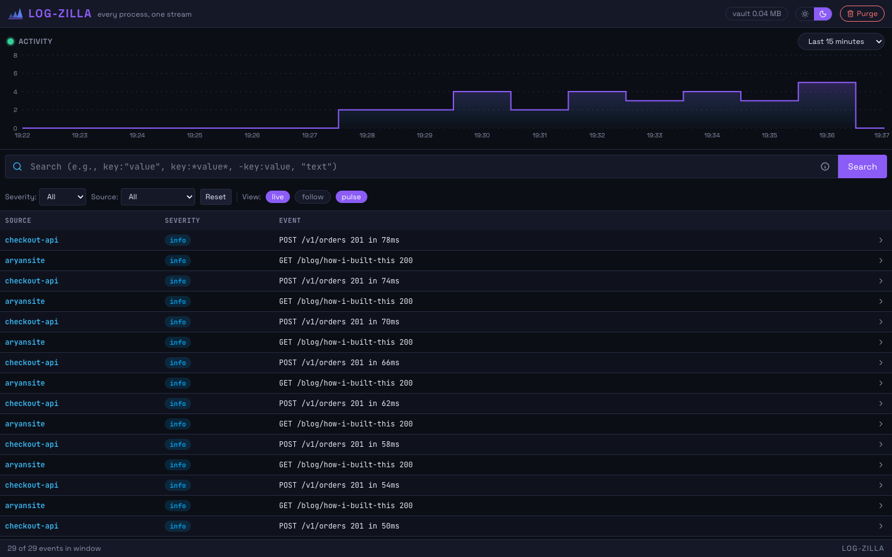
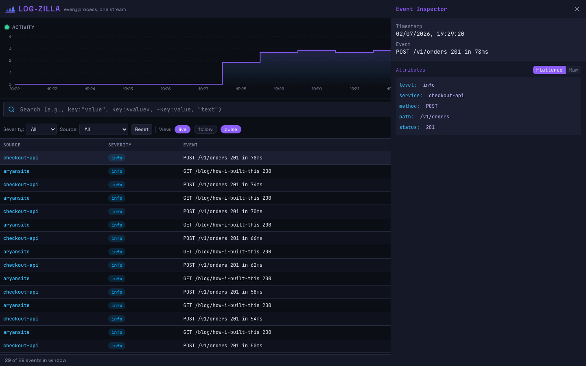
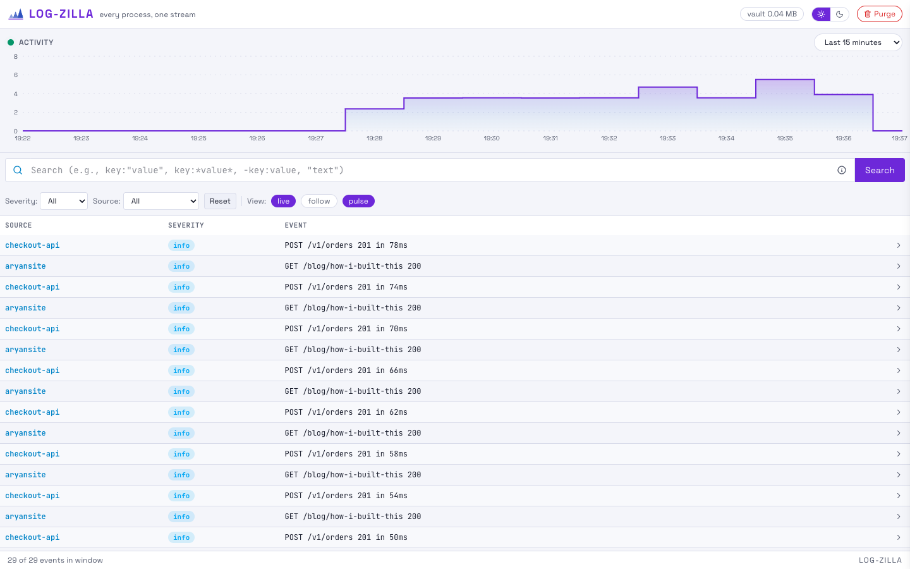

<p align="center">
  
</p>

# Log-zilla — Complete Setup Guide

Everything you need to go from a fresh clone to watching all of your local services stream into one console.



## 1. Prerequisites

| Tool | Why | Install |
|---|---|---|
| Docker | Runs the Log-zilla server | https://docs.docker.com/get-docker/ |
| Homebrew (macOS) | Installs fluent-bit | https://brew.sh |
| fluent-bit | Ships your process output to the server | `brew install fluent-bit` (the setup scripts do this for you) |

## 2. One-command setup

```bash
./scripts/quick-start.sh
```

This builds the Docker image, starts the server container on port 5454, installs the `logzilla` command to `/usr/local/bin`, and prints usage examples. When it finishes, open **http://localhost:5454**.

## 3. Manual setup (what the script does)

### Build and start the server

```bash
docker build -f Dockerfile.logzilla -t repo/logzilla .
docker run -d --name logzilla-server -p 5454:5454 -v ~/.logzilla:/data repo/logzilla
```

The SQLite database lands at `~/.logzilla/logzilla.db`, so your history survives container restarts.

### Install the logzilla command

```bash
./scripts/build-logzilla.sh
```

This writes a small wrapper to `/usr/local/bin/logzilla` (it will ask for sudo). The wrapper generates a fluent-bit config named after your current directory and streams whatever you run through it.

## 4. Feed it logs

From any project directory, either prefix your command:

```bash
cd my-node-service
logzilla npm run start
```

or pipe into it:

```bash
go run main.go | logzilla
python app.py | logzilla
./my-app | logzilla
```

The service name in the console is the directory name — `cd payments-service && logzilla npm start` shows up as `payments-service`.

## 5. Using the console

Open **http://localhost:5454**.

- **Search bar** — supports structured queries: `key:"value"` exact match, `key:*value*` contains, `-key:value` exclude, bare `"text"` searches all fields. Hover the ⓘ icon for the cheat sheet.
- **Severity / Source dropdowns** — one-click narrowing; the lists populate from whatever you've ingested.
- **Time range** — presets from 15 minutes to 30 days, plus a custom range picker, above the activity graph.
- **View pills** — `live` (auto-refresh), `follow` (auto-scroll), `pulse` (activity graph), all in the filter row.
- **Row click** — opens the event inspector; every attribute can be copied or turned into a filter with one click.



- **Dark / light mode** — the sun/moon switch in the header. Your choice is remembered in the browser.



- **Purge** — the red button in the header deletes stored logs by source and/or age (older than 7/14/30 days, or everything).

## 6. Configuration reference

| Variable | Default | Meaning |
|---|---|---|
| `PORT` | `5454` | Console port |
| `DB_PATH` | `~/.logzilla/logzilla.db` | SQLite file location |
| `LOGZILLA_HOST` | `localhost` | Where the `logzilla` command sends logs |
| `LOGZILLA_PORT` | `5454` | Port the `logzilla` command targets |

Custom port and database:

```bash
docker run -d --name logzilla-server -p 8080:8080 \
  -v /path/to/data:/data \
  repo/logzilla --port 8080 --db /data/logs.db
```

## 7. Day-to-day management

```bash
docker logs logzilla-server      # server logs
docker stop logzilla-server      # stop
docker start logzilla-server     # start again (data persists)
docker restart logzilla-server   # restart
docker rm logzilla-server        # remove (volume data survives)
```

## 8. Troubleshooting

**Console won't load** — `docker ps` to confirm the container is up, then `docker logs logzilla-server`.

**`logzilla: command not found`** — re-run `./scripts/build-logzilla.sh`; it must complete the sudo step.

**Logs don't appear** — confirm fluent-bit is installed (`fluent-bit --version`) and that the server answers: `curl http://localhost:5454/api/otel?limit=1`.

**Port already in use** — start the container with a different `-p` mapping and `--port` flag, and set `LOGZILLA_PORT` accordingly before using the `logzilla` command.
